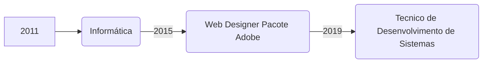
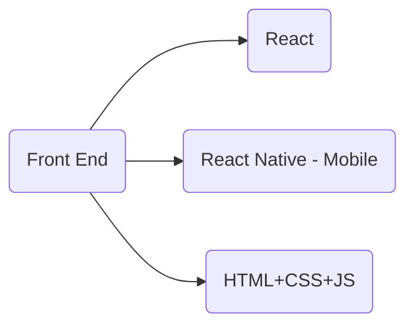
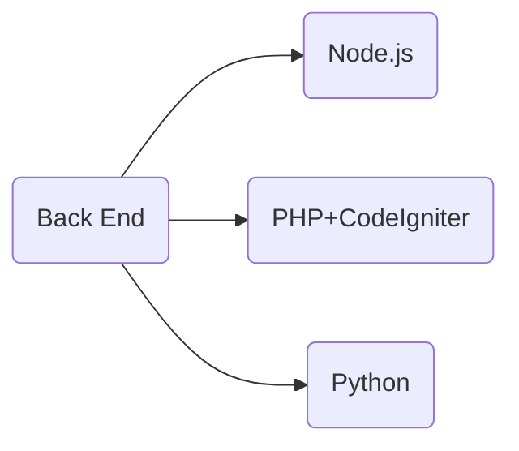
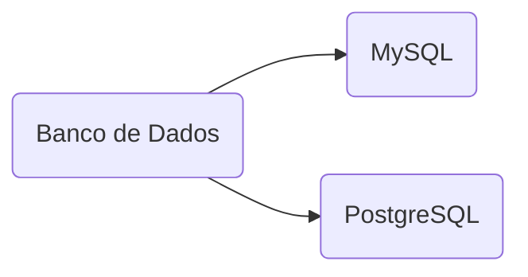

## David Pereira da Silva
 Tecnico de Desenvolvimento de Sistemas.

[(https://www.linkedin.com/in/david-da-silva-30280412a/)]

Desde criança, eu sou um entusiasta em tecnologia e em ajudar/auxiliar as pessoas. Sempre via que tínhamos que ajudar uns aos outros a resolver problemas através do que sabíamos.
  
Por isso sempre estarei disposto em colaborar com nosso cliente em ter sua problemática resolvida com a melhor metodologia e rápidez.

💻 Stacks:  React, React-Native, Node.j, Python, Javascript + HTML + CSS.
❤ Inspiração: Colaborar em Projetos pela Web afim de ajudar o nosso cliente a resolver os desafios do dia a dia.  

## Minha linha do tempo em Anos e Cursos Capacitação:

## Organograma de Stacks

